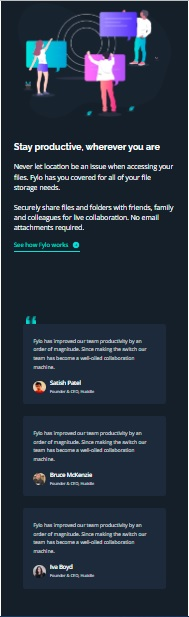

# Frontend Mentor - Fylo dark theme landing page solution

This is a solution to the [Fylo dark theme landing page challenge on Frontend Mentor](https://www.frontendmentor.io/challenges/fylo-dark-theme-landing-page-5ca5f2d21e82137ec91a50fd). Frontend Mentor challenges help you improve your coding skills by building realistic projects. 

## Table of contents

- [Overview](#overview)
  - [The challenge](#the-challenge)
  - [Screenshot](#screenshot)
  - [Links](#links)
- [My process](#my-process)
  - [Built with](#built-with)
  - [What I learned](#what-i-learned)
  - [Continued development](#continued-development)
  - [Useful resources](#useful-resources)
- [Author](#author)
- [Acknowledgments](#acknowledgments)

## Overview

### The challenge

Users should be able to:

- View the optimal layout for the site depending on their device's screen size
- See hover states for all interactive elements on the page

### Screenshot

| Desktop layout |
|:--:|
 

| Mobile layout |
|:--:|
 

### Links

- Solution URL: 
- Live Site URL: 

## My process

### Built with

- Semantic HTML5 markup
- CSS custom properties
- Flexbox
- CSS Grid
- Mobile-first workflow
- Sass
- BEM

### What I learned

- #### Nav items jumping when changing to bold on hover
I found a nice solution on Stack Overflow: a hidden pseudo-element provides the width and therefore prevents jumping. How elegant!
```css
.navigation__link {
    color: var(--clr-white-a);

    &::before {
        content: attr(title);
        visibility: hidden;
        display: block;
        font-weight: var(--fw-semiBold);
        height: 0;
        overflow: hidden;
    }

    &:hover {
        font-weight: var(--fw-semiBold);
        color: var(--clr-white);
        text-decoration: underline:
    }
}
```
Here is the link: [Inline elements shifting when made bold on hover](https://stackoverflow.com/questions/556153/inline-elements-shifting-when-made-bold-on-hover)

If the same problem is caused by an underline on hover, there is another solution, elegant as well - setting a transparent border:
```css
.navigation__link {
    color: var(--clr-white-a);
    border-bottom: 0.1rem solid transparent;

    &:hover {
        color: var(--clr-white);
        border-bottom: 0.1rem solid var(--clr-white);
    }
}
```
Also from Stack Overflow: [Menu jumps on hover](https://stackoverflow.com/questions/52457456/menu-jumps-on-hover)

- #### Different background color following curvy background image within a section of the mobile layout
The thing is, that in the mobile layout, the curvy background image is positioned in the middle of the section. Hence I need the background color to change below the background image. I solved it with multiple background - the image and a gradient with a color stop just under the part of the background image that takes full width of the section. Will see, whether this solution holds after I remove the width and make the layout fully responsive. Just in case I put a default background color.

```css
.landing__files {
    ...
    background-color: var(--bg-intro-email);
    background-image: 
        url(../../images/bg-curvy-mobile.svg), 
        linear-gradient(var(--bg-intro-email) 51%, var(--bg-main) 49%);
    background-position: 0% 40%, center;
    background-repeat: no-repeat, no-repeat;
}
```
- #### Quotes behind the blockquote container
I couldn't get the quotes in a ::before pseudo-element behind the blockquote container. I looked up the solution on Stack Overflow: [Is it possible to set the stacking order of pseudo-elements below their parent element?](https://stackoverflow.com/questions/3032856/is-it-possible-to-set-the-stacking-order-of-pseudo-elements-below-their-parent-e) and this works:
```css
/* parent element */
.testimonials {
    position: relative;
    z-index: 1;
    ...
}

/* pseudo-element's owner, no z-index */
.testimonials__container {
    position: relative;
    ...
}

/* pseudo-element itself */
.testimonials__container:first-child::before {
  position: absolute;
  z-index: -1;
  ...
}
```

### Continued development

It is going great with scss, I am getting used to it and I like it. 
I need to figure out though how to deal with so many font sizes like Huddle and Fylo layouts have. Way too many in my opinion.
I also need to be more consistent in BEM.

### Useful resources

I added the links in the text of [What I learned](#what-i-learned), respectively to the topic.

## Author

- GitHub - [PavlinaPs](https://github.com/PavlinaPs)
- Frontend Mentor - [@PavlinaPs](https://www.frontendmentor.io/profile/PavlinaPs)

## Acknowledgments

It is great that I can solve Frontend Mentor's challenges. They are all very useful for me. Every single one. Thank you!
